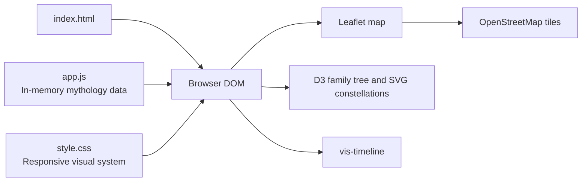

# 🏛️ Mythology Atlas

> An interactive browser atlas for exploring gods, creatures, artifacts, stories, timelines, and constellations across world mythologies.

[](LICENSE)
[](app.js)
[](index.html)

[Source](https://github.com/vincenzo-afk/Mythology-Atlas) · [Issues](https://github.com/vincenzo-afk/Mythology-Atlas/issues) · [Pull requests](https://github.com/vincenzo-afk/Mythology-Atlas/pulls) · [Security](SECURITY.md)

```text
        .-"""-.
       /  .-.  \
      |  /   \  |     MYTHOLOGY ATLAS
      |  \___/  |     Explore the stories of the gods
       \       /
        `-._.-'
```

## <a name="table-of-contents"></a>Table of Contents

- [About the Project](#about-the-project)
- [Tech Stack](#tech-stack)
- [Getting Started](#getting-started)
- [Usage](#usage)
- [Project Structure](#project-structure)
- [Features and Roadmap](#features-and-roadmap)
- [Testing](#testing)
- [Deployment](#deployment)
- [Contributing](#contributing)
- [Security](#security)
- [License](#license)
- [Acknowledgments](#acknowledgments)
- [References](#references)

---

## <a name="about-the-project"></a>About the Project

Mythology Atlas is a client-side educational exploration interface. It keeps the mythology dataset in `app.js` and renders that data into a set of interactive views in the browser. The current interface contains entries for **Greek, Norse, Egyptian, Hindu, Japanese, Celtic, and Aztec** mythology, with culture-specific colors and map locations.

The application is designed for browsing and comparison rather than account-based workflows or server-side storage. There is no backend, database, build pipeline, API server, or environment-variable configuration in the repository.

### Key features

- **World Map:** View culture locations with Leaflet-powered map markers and popups.
- **Divine Family Tree:** Explore relationships with a D3-rendered, draggable and zoomable graph.
- **Creatures and Monsters:** Search the current culture's creature collection.
- **Divine Battle Simulator:** Select two available entities and compare their power values through a battle log.
- **Sacred Stories and Epics:** Browse story summaries and related characters.
- **Divine Artifacts and Relics:** Read artifact descriptions, owners, types, and powers.
- **Mythological Timeline:** Explore chronology through vis-timeline.
- **Constellation Map:** Inspect interactive SVG constellation illustrations and their associated myths.
- **Theme toggle:** Switch between the default dark presentation and the light theme.
- **Detail views:** Open side panels and modal dialogs for related entities and extended descriptions.

### Architecture overview



### Screenshots

The repository does not currently include screenshots or a hosted demo URL. To preview the interface, follow the local development steps below.

---

## <a name="tech-stack"></a>Tech Stack

| Area | Technology | Version or source | Role |
|---|---|---|---|
| Markup | HTML | HTML5 | Page shell and accessible controls |
| Styling | CSS | Native CSS | Layout, themes, responsive behavior, and visual styling |
| Application logic | JavaScript | ES6+ | In-memory data, rendering, state, interactions, and utilities |
| Mapping | Leaflet | 1.9.4 | Interactive map and culture markers |
| Data visualization | D3 | 7 | Family tree graph and SVG visualizations |
| Timeline | vis-timeline | CSS 7.5.0; JavaScript 7.7.3 | Historical timeline rendering |
| Typography | Google Fonts | Cinzel and Crimson Text | Display and body typography |
| Map tiles | OpenStreetMap | Public tile endpoint | Geographic basemap |
| Hosting model | Static files | No build tool configured | Can be served by any static web server |

All third-party browser libraries are loaded from public content-delivery networks in `index.html`. Their configured URLs are listed in the [References](#references) section.

---

## <a name="getting-started"></a>Getting Started

### Prerequisites

You need a modern web browser with JavaScript enabled and a local static file server. Python 3 is a convenient option for local preview; no package manager, Node.js installation, API key, or database is required by the repository.

### Installation

Clone the repository and enter its directory:

```bash
git clone https://github.com/vincenzo-afk/Mythology-Atlas.git
cd Mythology-Atlas
```

Because the project uses browser-loaded scripts and external map tiles, serve it over HTTP instead of opening `index.html` directly from the filesystem:

```bash
python3 -m http.server 8000
```

Open [http://localhost:8000](http://localhost:8000) in a browser. Stop the server with `Ctrl+C`.

### Configuration

The application has no `.env` file, runtime configuration file, or environment variables. Mythology content and UI configuration are defined directly in `app.js` and `index.html`.

| Configuration area | Location | How to change it |
|---|---|---|
| Mythology records | `app.js` → `MYTHOLOGY_DATA` | Add or edit culture data, entities, stories, timelines, and relationship links |
| Culture navigation | `index.html` → `#cultureButtons` | Add or edit culture buttons and their color variables |
| Main views | `index.html` → `#tabsBar` and tab panels | Add or reorder interface tabs and their containers |
| Visual theme | `style.css` and `app.js` → `toggleTheme()` | Adjust CSS variables or theme behavior |
| Map tiles | `app.js` → `initMap()` | Change the Leaflet tile layer only if the attribution and provider terms remain satisfied |

---

## <a name="usage"></a>Usage

After opening the site, select a mythology from the culture bar and choose one of the views in the tab bar.

| View | Interaction |
|---|---|
| World Map | Pan and zoom the map, then select a marker for a culture summary. |
| Family Tree | Drag nodes, scroll to zoom, and select a node to open its details. |
| Monsters | Type in the search field to filter the active culture's creatures. |
| Battle Sim | Choose a challenger and opponent, review their cards, and run the comparison. |
| Stories | Select a story card to read the summary and character list. |
| Artifacts | Select an artifact card to read its description and associated power. |
| Timeline | Pan and zoom the historical timeline. |
| Constellations | Hover over a constellation and select it for additional details. |

The data is bundled in the page. Changes made to `app.js` are visible after refreshing the browser; there is no persistence layer or server-side synchronization.

---

## <a name="project-structure"></a>Project Structure

```text
Mythology-Atlas/
├── app.js        # Mythology dataset, view rendering, state, and interactions
├── index.html    # Page shell, navigation, tab panels, modal, and script imports
├── style.css     # Layout, themes, component styling, and responsive rules
├── LICENSE       # MIT license text
└── README.md     # Project documentation
```

The project intentionally keeps its implementation small: the browser loads the HTML shell, applies the stylesheet, and executes the JavaScript module in a single page.

---

## <a name="features-and-roadmap"></a>Features and Roadmap

### Current capabilities

- ✅ Seven mythology culture selections are present in the interface.
- ✅ Eight interactive views are wired into the page.
- ✅ Culture-specific map centers, colors, and data are defined in `app.js`.
- ✅ Relationship, story, artifact, creature, timeline, and constellation data are rendered in the browser.
- ✅ Dark and light presentation modes are available.

### Known limitations

- The application uses an in-memory dataset; edits are code changes and are not persisted through a database.
- External CDN resources and OpenStreetMap tiles require network access when the page is loaded.
- The repository does not currently contain automated tests, a build script, or a deployment configuration.
- There is no versioned changelog yet. Release history is available through the repository's [commit log](https://github.com/vincenzo-afk/Mythology-Atlas/commits/main).

### Roadmap

Future work should be proposed through a GitHub issue so that scope and acceptance criteria can be discussed before implementation. This README does not claim unimplemented functionality as planned work.

---

## <a name="testing"></a>Testing

No automated test framework or test script is present in the repository. Before submitting a change, perform a browser smoke test using the local server:

1. Load the page and confirm that the default map view renders.
2. Switch through all seven culture buttons.
3. Open each of the eight tabs and verify that its content renders.
4. Exercise the monster search, family-tree selection, map markers, battle simulator, modal dialogs, side panel, theme toggle, timeline, and constellation interactions relevant to the change.
5. Check the browser console for errors and test a narrow viewport if the change affects layout.

---

## <a name="deployment"></a>Deployment

The repository contains only static assets and has no deployment-specific configuration. It can therefore be published by any static hosting service that serves the repository root, such as GitHub Pages or another static web host.

For a deployment, ensure that `index.html`, `app.js`, and `style.css` remain at the served root and that the host permits outbound requests to the configured CDN and OpenStreetMap tile URLs. No build or environment-variable step is required by the repository.

---

## <a name="contributing"></a>Contributing

Please read [CONTRIBUTING.md](CONTRIBUTING.md) before opening a pull request. Contributions should keep the application client-side, preserve the existing visual language, and avoid introducing dependencies or claims that are not supported by the implementation.

For content changes, verify names, relationships, dates, and descriptions before submission. For interface changes, include the browser smoke-test steps you performed and describe any visual behavior that reviewers should check.

---

## <a name="security"></a>Security

The application does not currently process accounts, credentials, private data, or server-side requests. Report suspected vulnerabilities privately using the process in [SECURITY.md](SECURITY.md), and do not disclose exploitable details in a public issue.

---

## <a name="license"></a>License

Mythology Atlas is distributed under the [MIT License](LICENSE). The repository's license file identifies the copyright holder as **BHARANI KUMAR S**.

---

## <a name="acknowledgments"></a>Acknowledgments

The project uses [Leaflet](https://leafletjs.com/), [D3](https://d3js.org/), and [vis-timeline](https://visjs.github.io/vis-timeline/) for interactive visualization. Geographic tiles are provided through [OpenStreetMap](https://www.openstreetmap.org/) and are displayed with the required attribution in the map interface.

---

## <a name="references"></a>References

1. [Leaflet 1.9.4 JavaScript and CSS assets](https://unpkg.com/leaflet@1.9.4/dist/leaflet.js)
2. [D3 7 distribution](https://cdn.jsdelivr.net/npm/d3@7)
3. [vis-timeline 7.5.0 stylesheet](https://unpkg.com/vis-timeline@7.5.0/dist/vis-timeline-graph2d.min.css)
4. [vis-timeline 7.7.3 JavaScript distribution](https://unpkg.com/vis-timeline@7.7.3/standalone/umd/vis-timeline-graph2d.min.js)
5. [OpenStreetMap tile and attribution policy](https://www.openstreetmap.org/copyright)
6. [GitHub Pages documentation](https://docs.github.com/en/pages)

<p align="right"><a href="#table-of-contents">Back to top</a></p>

---

Built with care by [vincenzo-afk](https://github.com/vincenzo-afk).
